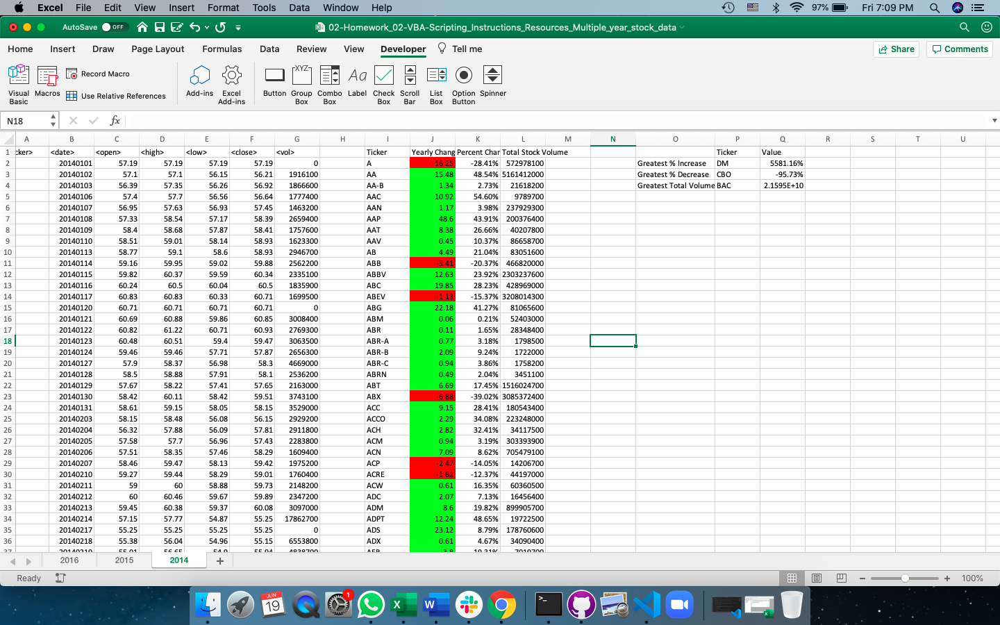
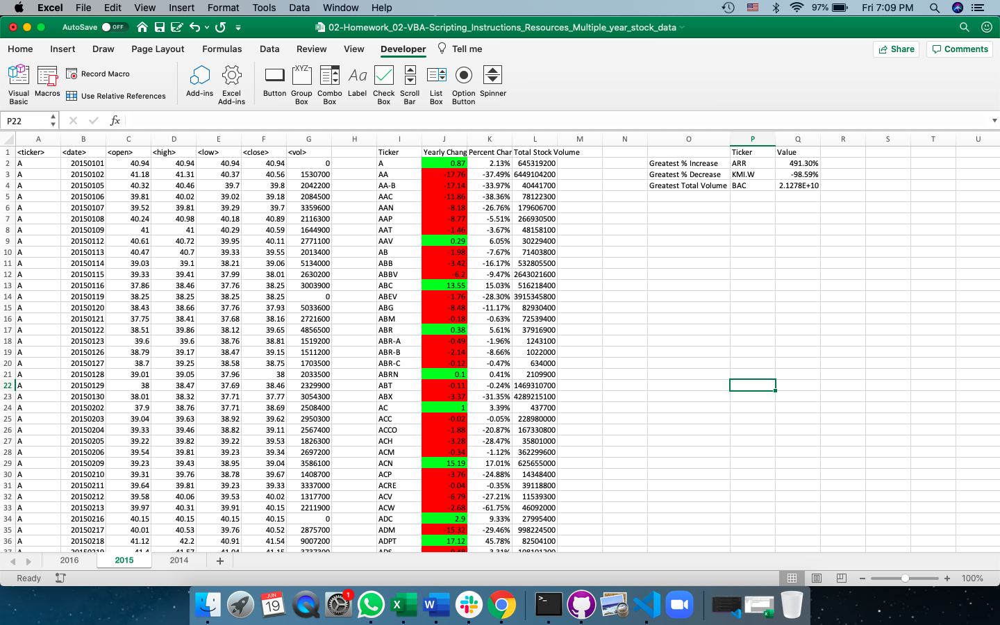
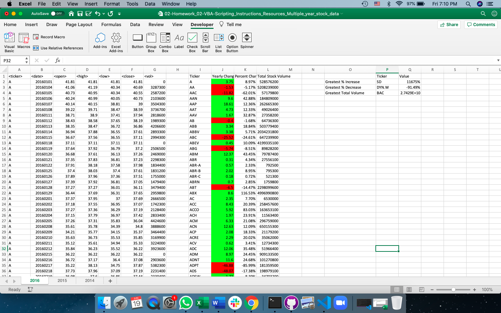

# VBA-Homework
Used VBA scripting to analyze real stock market data. 

### Files

* [Test Data](Resources/alphabetical_testing.xlsx) - Used this while developing your scripts.

* [Stock Data](Resources/Multiple_year_stock_data.xlsx) - Runned my scripts on this data to generate the final report.

### Stock market analyst

In order to run the analysis, I create a script that will loop through all the stocks for one year and output the following information.

  * The ticker symbol.

  * Yearly change from opening price at the beginning of a given year to the closing price at the end of that year.

  * The percent change from opening price at the beginning of a given year to the closing price at the end of that year.

  * The total stock volume of the stock.

  * Included conditional formatting that will highlight positive change in green and negative change in red.
 
 Here are the screenshot of how the conditional formatting looks like for year 2014:
 
 

 Year 2015 stock price change:
 
 
 
 Year 2016 stock price change:
 
 
 
 These calculations also display the greatest percent increase, decrease and the greatest total volume for each year.